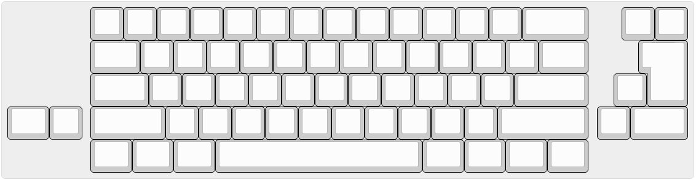

# Switch soldering

## note

Depending on the accuracy of the mounting holes, the switch may stick diagonally. (Especially, it stands out with the MOD key such as long Shift.) After fitting the switch once, check it, and if it becomes slanted, we recommend the following measures.

- Cut off the plastic foot of the switch
- Widen the holes in the board

Unplug the USB cable and solder the switch. You can choose from several layouts such as ANSI, ISO, hhkb, and split BackSpace.
Check the layout before soldering.

If the switch does not interfere, any layout you choose will work by rewriting the firmware.

## For PCB Layout

You can choose ISO layout instead of the ANSI layout



# Installation of stabilizer

Install the stabilizer in the required position.

# Installation of bottom PCB and acrylic cover

Install with screws and nuts as shown below. The direction of the screws and the number of nuts used in the part where the cover is not attached and the part where the cover is attached are different. For the part without the cover, attach screws and nuts to the Main PCB side, and for the part to attach the cover, attach the screws to the Bottom PCB side, align both PCBs, and attach the remaining nuts.

## Case

```
[Screw ↓]
-----------------
Main PCB
-----------------
[Standoff]
-----------------
Bottom Plate
-----------------
[Nut]
```

# carry out !

Attach the keycap and you're done.
Thank you for your hard work.
