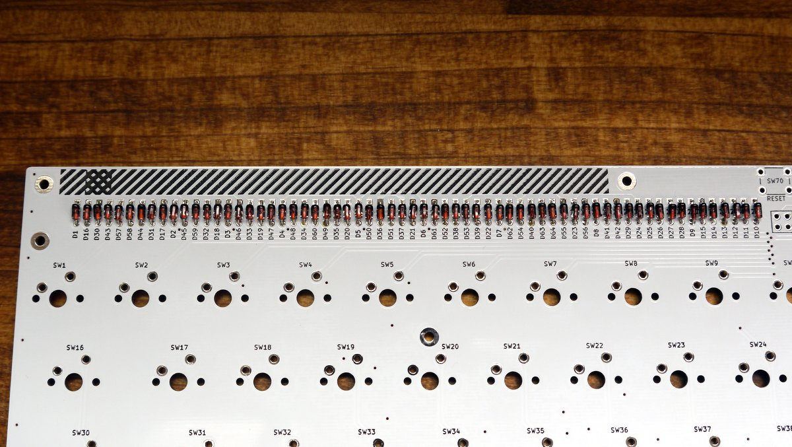
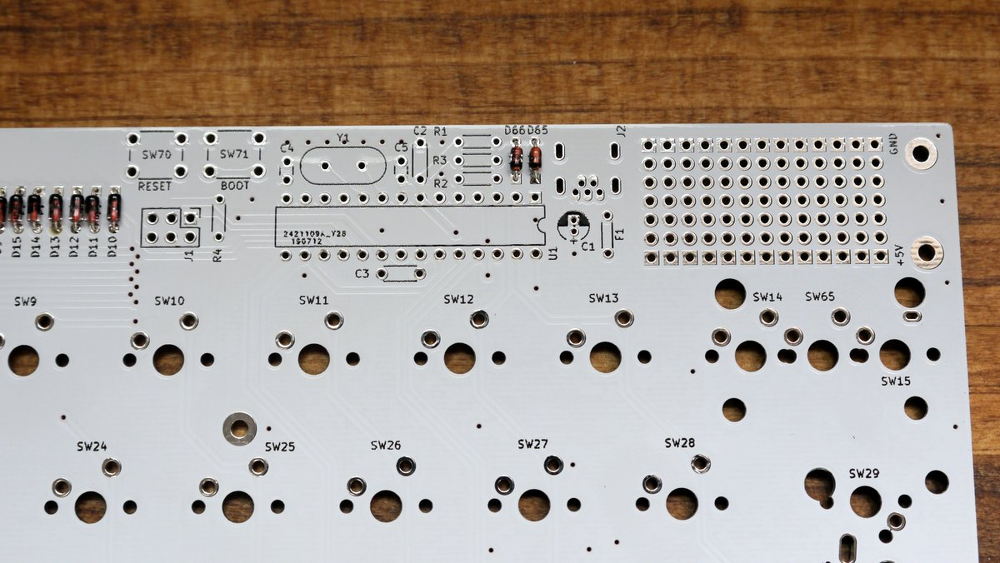
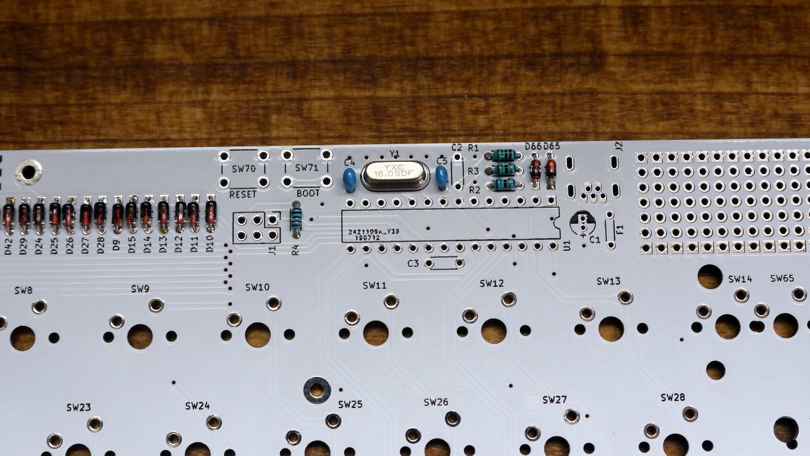
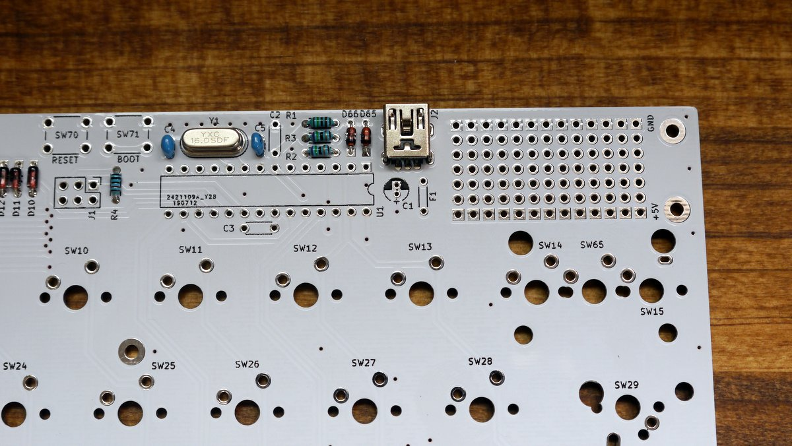
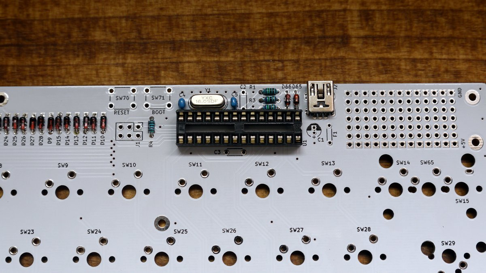
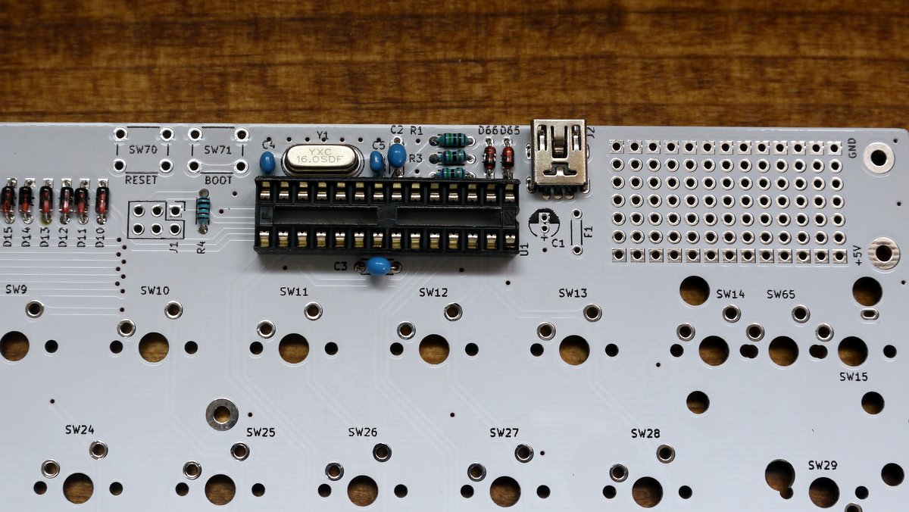
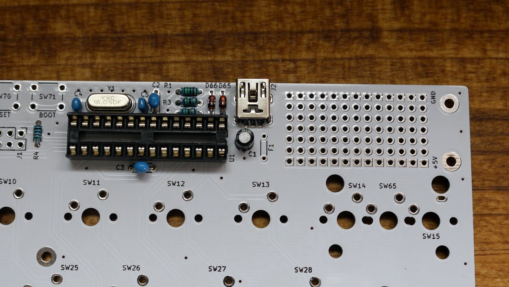
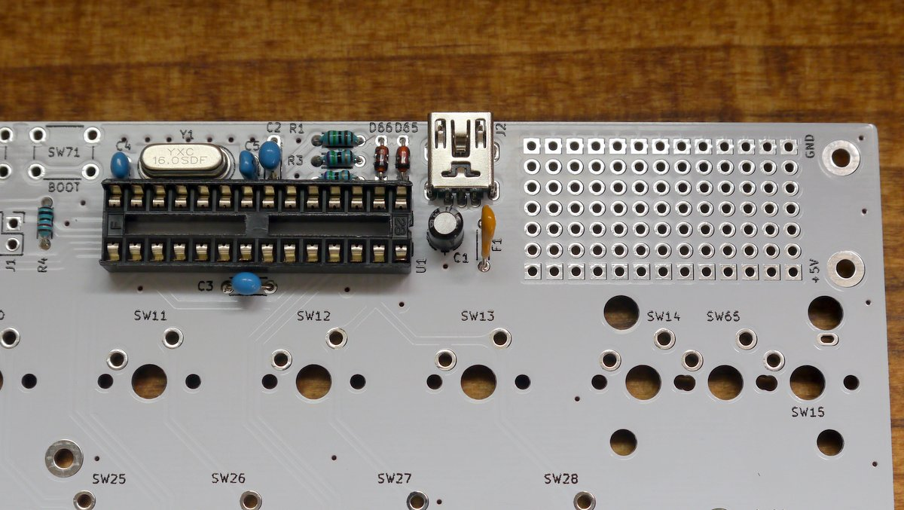
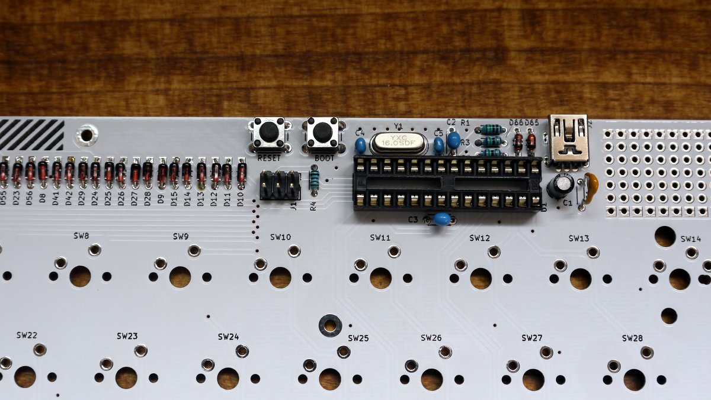

# Soldering

## Before starting assembly

- Check the [BOM](./BOM.md) to see if the parts are complete
- If you are unfamiliar with soldering, study at the following site
  - Links in the tool memo required to create the Helix keyboard kit- Soldering
  - https://learn.adafruit.com/adafruit-guide-excellent-soldering/tools

## Soldering

### Diode (1N4148)

Solder D1-D64. There is a diode polarity. Please note the orientation.
The one with the black band of the diode is the cathode. (PCB square pad side)

### Zener diode

Solder D65 and D66. There is a diode polarity . Please note the orientation.
The one with the black band of the diode is the cathode. (Square pad side of PCB) The
pad to be soldered may be small, so warm it firmly so that it conducts inside the hole.

### Resistor

Solder the resistor.

| Ref   | value | Color code                            |
| ----- | ----- | ------------------------------------- |
| R1    | 1.5k  | Brown / Green / Red / Gold            |
| R2,R3 | 75    | Violet / Green / Black / Gold / Brown |
| R4    | 10k   | Brown / Black / Orange / Gold         |

### Crystal and Multilayer Ceramic Capacitors (22pF)

There are two types of multilayer ceramic capacitors.
It can be determined by the lead spacing.

| Ref  | value | lead spacing |
| ---- | ----- | ------------ |
| C4,5 | 22pF  | 2.5mm        |

### USB connector

Be careful of the bridge as the pin spacing is narrow.
Check carefully after soldering.

### IC socket

There is an IC socket .
Align the notch at the end of the IC socket with the silk on the PCB.

### Multilayer ceramic capacitor (0.1uF)

There are two types of multilayer ceramic capacitors.
It can be determined by the lead interval.

| Ref  | value | lead spacing |
| ---- | ----- | ------------ |
| C2,3 | 0.1uF | 5mm          |

### Electrolytic capacitor (C1)

There is an electrolytic capacitor . Please note the orientation.
The shorter leg is the cathode. (PCB square pad)

### Resettable Fuse (F1)

### Tactile switch and pin header

### ATMEGA328P

Insert the ATMEGA328P into the IC socket.

There is ATMEGA328P polarity. Please note the orientation.
Align the notch of the IC socket with the notch of ATMEGA328P.
Please also refer to the image.

## Checklist before connecting the USB cable

- Is VCC (5V) short-circuited with GND, or is the pin of the USB connector short-circuited?
- Orientation of polar parts (ATMEGA328P, diode, resettable fuse, electrolytic capacitor)
- Resistance value and location

## NEXT

[Connect the USB cable and test the bootloader](./bootloader.md)
